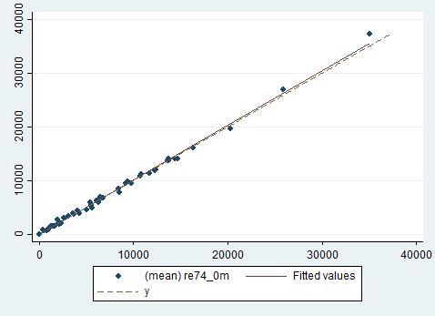
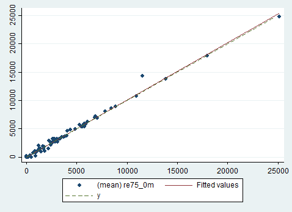
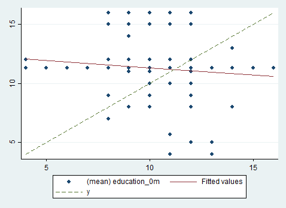
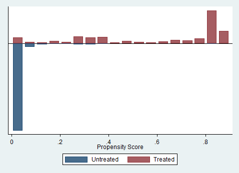
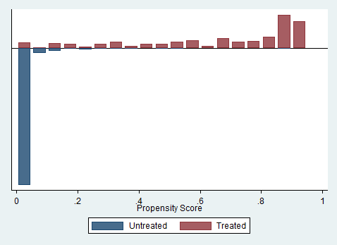

# Part I. Direct Matching

## 1.

```
qui{
	capture program drop make_table
	program define make_table
		syntax varlist(numeric)
		
			matrix table1 = J(4, 8, .)
			matrix colnames table1 = `varlist'
			matrix rownames table1 = trt_mean comp_mean diff_mean diff_se

			local i = 1
			foreach var in `varlist' {

				qui ttest `var', by(treat)
				
				matrix table1[1, `i'] = round(r(mu_2), 0.01)
				matrix table1[2, `i'] = round(r(mu_1), 0.01)
				matrix table1[3, `i'] = round(r(mu_1)-r(mu_2), 0.01)
				matrix table1[4, `i'] = round(r(se), 0.01)
				
				local i = `i'+1
			}

			matrix list table1
	end
}


use "nsw_dw.dta", clear

keep if data_id == "Dehejia-Wahba Sample"

make_table age education black hispanic nodegree married re74 re75

                 age  education      black   hispanic   nodegree    married       re74       re75
 trt_mean      25.82      10.35        .84        .06        .71        .19    2095.57    1532.06
comp_mean      25.05      10.09        .83        .11        .83        .15    2107.03    1266.91
diff_mean       -.76       -.26       -.02        .05        .13       -.04      11.45    -265.15
  diff_se        .68        .17        .04        .03        .04        .04     516.48     303.16

use "nsw_dw.dta", clear

drop if data_id == "Dehejia-Wahba Sample" & treat == 0

make_table age education black hispanic nodegree married re74 re75

                 age  education      black   hispanic   nodegree    married       re74       re75
 trt_mean      25.82      10.35        .84        .06        .71        .19    2095.57    1532.06
comp_mean      34.85      12.12        .25        .03        .31        .87   19428.75   19063.34
diff_mean       9.03       1.77       -.59       -.03        -.4        .68   17333.17   17531.28
  diff_se        .78        .23        .03        .01        .04        .03     990.69    1001.91
```

***

The non-experimental comparison and treatment group are highly imbalanced across these covariates compared to the experimental treatment adn control group. There are very large (and statistically significant) differences between the treatment and non-experimental comparison group that suggest that the comparison group would have much higher earnings than the treatment group.

***

## 2.

```
use "nsw_dw.dta", clear

drop if data_id == "Dehejia-Wahba Sample" & treat == 0

* Prep data sets for mergin back in after matching procedure
* create id and index vars to match on
gen id = _n
gen index = _n

* rename variables to accomdate wide format created by matching
preserve
rename * *_1m
rename id_1m id
save "treat", replace
restore

preserve
rename * *_0m
rename index_0m index
save "comparison", replace
restore


nnmatch re78 treat re74 re75, keep(match_info) replace

----------+----------------------------------------------------------------
     re78 |      Coef.   Std. Err.      z    P>|z|     [95% Conf. Interval]
----------+----------------------------------------------------------------
     SATE |  -10475.37   3936.875    -2.66   0.008     -18191.5   -2759.233
----------+----------------------------------------------------------------
```

***

The estimated treatment effect is -10475.37. This is in the opposite direction, and much larget than experimental treatment effect.


```
use "match_info", clear

keep if treat == 1

* merge back in other covariates dropped in matching process
merge m:1 id using "treat", ///
	keepusing(age_1m education_1m black_1m hispanic_1m married_1m nodegree_1m) ///
	keep(master match) nogen

merge m:1 index using "comparison", ///
	keepusing(age_0m education_0m black_0m hispanic_0m married_0m nodegree_0m) ///
	keep(master match) nogen

* get one row per observation (from tie matches)
collapse (mean) re74_* re75_* education_* index, by(id)

* check quality of matching for re74

reg re74_0m re74_1m
	* R-squared     =  0.9977
	
twoway (scatter re74_0m re74_1m) (lfit re74_0m re74_1m) || ///
	function y = x, ra(re74_0m) clpat(dash)
```


The observations are being very well matched on re74. Regressing the matched re74 on the treatment re74 the R-Squared is 0.9977.

```
* check quality of matching for re74
reg re75_0m re75_1m
	* R-squared     =  0.9929
	
twoway (scatter re75_0m re75_1m) (lfit re75_0m re75_1m)  || ///
	function y = x, ra(re75_0m) clpat(dash)
```


The observations are also being very well matched on re75. Regressing the matched re75 on the treatment re75 the R-Squared is 0.9929.

## 3.

```	
* check balance of education treatment and matched comparison
ttest education_1m ==  education_0m
	* mean(diff) -.9477146   (se) .2238233
	
twoway (scatter education_0m education_1m) (lfit education_0m education_1m) || ///
	function y = x, ra(education_0m) clpat(dash)
```


***

Education is being very poorly matched when using only the pre-treatment income variables. The mean difference between the treatment and matched education is .95 years, and is statistically significant.


## 4.

```
use "nsw_dw.dta", clear

drop if data_id == "Dehejia-Wahba Sample" & treat == 0

gen re74_sq = re74 ^ 2
gen re75_sq = re75 ^ 2

local covariates "education black hispanic married re74 re75 re74_sq re75_sq"

nnmatch re78 treat `covariates', keep(match_info2) replace

*        re78 |      Coef.   Std. Err.      z    P>|z|     [95% Conf. Interval]
*-------------+----------------------------------------------------------------
*        SATE |  -11653.45   3990.061    -2.92   0.003    -19473.83   -3833.078


use "match_info2", clear

keep if treat == 1

* merge back in other covariates dropped in matching process
merge m:1 id using "treat", keepusing(age nodegree_1m) keep(master match) nogen

merge m:1 index using "comparison", keepusing(age nodegree_0m) keep(master match) nogen

drop re74 re75 re74_sq re75_sq
local collapse_vars = "treat re78_* age_* education_* black_* hispanic_* nodegree_* married_* re74_* re75_* km index dist"

collapse (mean) `collapse_vars', by(id) 

local vars "age education black hispanic nodegree married re74 re75"

matrix table1 = J(3, 8, .)
matrix colnames table1 = `vars'
matrix rownames table1 = trt_mean comp_mean diff_se

matrix list table1 

local i = 1
foreach var in `vars' {

	qui ttest `var'_0m == `var'_1m
	
	matrix table1[1, `i'] = round(r(mu_2), 0.01)
	matrix table1[2, `i'] = round(r(mu_1), 0.01)
	matrix table1[3, `i'] = round(r(se), 0.01)
	
	local i = `i'+1
}

* Assess the quality of the matches for each covariate
matrix list table1

*              age  education  black  hispanic  nodegree  married     re74     re75
* trt_mean   25.82      10.35    .84       .06       .71      .19  2095.57  1532.06
*comp_mean   29.34       10.3    .84       .06       .71      .19  2521.42  1712.76
*  diff_se     .82        .03      0         0         0        0   113.68   114.88
```

The matched comparison group is now much better matched with the treatment group acrossthese covariates, however the comparison group is still more than 3 years older on average, and makes more than $400 more than the treatment group in 1974.


```
ttest re78_1 == re78_0

*        |      Mean  Std. Err. 
* re78_1 |  6349.144   578.4229   
* re78_0 |  4951.368    557.107   
*--------+----------------------
*  diff  | 1397.775     777.192

* Ha: mean(diff) != 0  
* Pr(|T| > |t|) = 0.0737 

use "nsw_dw.dta", clear
keep if data_id == "Dehejia-Wahba Sample"
ttest re78, by(treat) 

* Experimental treatment effect estimate
* --------------------------------------
------------------------------------------------------------------------------
   Group |     Obs        Mean    Std. Err.   Std. Dev.   [95% Conf. Interval]
---------+--------------------------------------------------------------------
 Control |     260    4554.801    340.0931    5483.836    3885.102    5224.501
 Treated |     185    6349.144    578.4229    7867.402    5207.949    7490.338
---------+--------------------------------------------------------------------
    diff |           -1794.342    632.8534                -3038.11   -550.5745
------------------------------------------------------------------------------

 Ha: diff != 0 
 Pr(|T| > |t|) = 0.0048 
 
```

The estimated treatment effect using the matching method is 1397.78 while experimental treatment effect estimate is 1794.34.

***


# Part II. Propensity Score Matching

## 5.

```
use "nsw_dw.dta", clear

drop if data_id == "Dehejia-Wahba Sample" & treat == 0

gen re74_sq = re74 ^ 2
gen re75_sq = re75 ^ 2

local spec_5_vars "education black hispanic married re74 re75 re74_sq re75_sq"

qui logit treat `spec_5_vars'

predict p_score

save "spec_5", replace

psgraph, t(treat) p(p_score)
```


```
* randomize sort of dataset so ties are matched at random
set seed 20161206
gen u = uniform()
sort u

psmatch2 treat, pscore(p_score) outcome(re78) neighbor(1) ate

local covariates "age education black hispanic nodegree married re74 re75"

pstest `covariates'

/*
------------------------------------------------------------------------------
                        |       Mean               |     t-test    |  V(T)/
Variable                | Treated Control    %bias |    t    p>|t| |  V(C)
------------------------+--------------------------+---------------+----------
age                     | 25.816   28.627    -31.4 |  -3.09  0.002 |  0.50*
education               | 10.346   10.605    -10.0 |  -1.09  0.275 |  0.63*
black                   | .84324   .84324      0.0 |  -0.00  1.000 |     .
hispanic                | .05946   .04865      5.2 |   0.46  0.647 |     .
nodegree                | .70811   .56757     30.7 |   2.84  0.005 |     .
married                 | .18919   .15676      8.8 |   0.82  0.411 |     .
re74                    | 2095.6   1920.3      1.7 |   0.40  0.693 |  1.91*
re75                    | 1532.1   1832.1     -3.0 |  -0.81  0.421 |  0.68*
------------------------------------------------------------------------------
*/
```
The covariates are very well balanced for everything except `age` and `nodegree`, where the comparison group is older and more likely to have a degree. Both of these differences are statisticaly significant. 

***


## 6.

```
* Propensity score matched treatment effect estimate -----------------------------------------------------
----------------------------------------------------------------------------------------
        Variable     Sample |    Treated     Controls   Difference         S.E.   T-stat
----------------------------+-----------------------------------------------------------
            re78  Unmatched |  6349.1435   21553.9209  -15204.7774   1154.61433   -13.17
                        ATT |  6349.1435   4584.23534   1764.90816   1902.95748     0.93
                        ATU | 21553.9209   6107.88894   -15446.032            .        .
                        ATE |                          -14255.7427            .        .
----------------------------+-----------------------------------------------------------


* Experimental treatment effect estimate
-----------------------------------------
------------------------------------------------------------------------------
   Group |     Obs        Mean    Std. Err.   Std. Dev.   [95% Conf. Interval]
---------+--------------------------------------------------------------------
 Control |     260    4554.801    340.0931    5483.836    3885.102    5224.501
 Treated |     185    6349.144    578.4229    7867.402    5207.949    7490.338
---------+--------------------------------------------------------------------
    diff |           -1794.342    632.8534                -3038.11   -550.5745
------------------------------------------------------------------------------
```
Propensity score matched treatment effect estimate is 1764.91 while the experimental treatment effect estimate is 1794.34, so this matching method is working extremely well.

***


## 7.

Given that the matches in the above specification were not well ballanced for `age` and `nodegree` it's possible that the propensity score specification can be improved by adding these variables. Below I estimate the propensity score with all the variables from the previous specification and add age, age-squared, no degree, and an interaction term for education and nodegree. 

```
use "nsw_dw.dta", clear

drop if data_id == "Dehejia-Wahba Sample" & treat == 0

gen re74_sq = re74 ^ 2
gen re75_sq = re75 ^ 2
gen age_sq = age ^ 2
gen educ_nodegree = education*nodegree

local spec_7_vars "age age_sq education black hispanic nodegree educ_nodegree married re74 re75 re74_sq re75_sq"

qui logit treat `spec_7_vars'

predict p_score

save "spec_7", replace

psgraph, t(treat) p(p_score)
```


```
* randomize sort of dataset so ties are matched at random
set seed 20161206
gen u = uniform()
sort u

psmatch2 treat, pscore(p_score) outcome(re78) neighbor(1) ate


local covariates "age education black hispanic nodegree married re74 re75"

pstest `covariates'

------------------------------------------------------------------------------
                        |       Mean               |     t-test    |  V(T)/
Variable                | Treated Control    %bias |    t    p>|t| |  V(C)
------------------------+--------------------------+---------------+----------
age                     | 25.816   25.827     -0.1 |  -0.02  0.988 |  1.24
education               | 10.346   10.184      6.2 |   0.75  0.453 |  0.88
black                   | .84324   .87027     -6.7 |  -0.74  0.459 |     .
hispanic                | .05946   .04865      5.2 |   0.46  0.647 |     .
nodegree                | .70811    .6973      2.4 |   0.23  0.821 |     .
married                 | .18919   .12432     17.6 |   1.72  0.087 |     .
re74                    | 2095.6   2397.7     -3.0 |  -0.68  0.495 |  1.94*
re75                    | 1532.1     2046     -5.2 |  -1.63  0.105 |  1.28
------------------------------------------------------------------------------
```

This new specification achieves much better balance across all the covariates. Now there are no signiciant differences between the treatment and comparisons groups on any of these covariates.

```

* Propensity score matched treatment effect estimate
----------------------------------------------------
----------------------------------------------------------------------------------------
        Variable     Sample |    Treated     Controls   Difference         S.E.   T-stat
----------------------------+-----------------------------------------------------------
            re78  Unmatched |  6349.1435   21553.9209  -15204.7774   1154.61433   -13.17
                        ATT |  6349.1435   5494.63469    854.50881   1299.69314     0.66
                        ATU | 21553.9209     6593.604  -14960.3169            .        .
                        ATE |                          -13866.5813            .        .
----------------------------+-----------------------------------------------------------


* Experimental treatment effect estimate
----------------------------------------
------------------------------------------------------------------------------
   Group |     Obs        Mean    Std. Err.   Std. Dev.   [95% Conf. Interval]
---------+--------------------------------------------------------------------
 Control |     260    4554.801    340.0931    5483.836    3885.102    5224.501
 Treated |     185    6349.144    578.4229    7867.402    5207.949    7490.338
---------+--------------------------------------------------------------------
    diff |           -1794.342    632.8534                -3038.11   -550.5745
------------------------------------------------------------------------------
```

Despite the apparently improved balance ofcovariates, the estimated treatment effect is now only 854.51, which is much lower than the experimental treatment effect of 1794.34, so it seems the matching has not acctually improved the estimate realative to the experiment.

***


# Part III. Propensity Score Weighting

## 8.

```
use "nsw_dw.dta", clear

drop if data_id == "Dehejia-Wahba Sample" & treat == 0

gen re74_sq = re74 ^ 2
gen re75_sq = re75 ^ 2
gen age_sq = age ^ 2
gen educ_nodegree = education*nodegree

local spec_5_vars "education black hispanic married re74 re75 re74_sq re75_sq"

qui logit treat `spec_5_vars'

predict p_score


gen ipw_ate = re78 * ((treat - p_score) / (p_score * (1 - p_score)))
qui sum ipw_ate
di r(mean)
* -8780.056

gen ipw_att = re78 * ((treat - p_score) / ((1 - p_score)))
qui sum ipw_att 
di (1 / (185 / 2675)) * r(mean)
* 2167.4583

reg re78 treat `spec_5_vars' [pweight = p_score]

drop p_score ipw_ate ipw_att

------------------------------------------------------------------------------
             |               Robust
        re78 |      Coef.   Std. Err.      t    P>|t|     [95% Conf. Interval]
-------------+----------------------------------------------------------------
       treat |   431.7796   817.8577     0.53   0.598    -1171.918    2035.477


local spec_7_vars "age age_sq education black hispanic nodegree educ_nodegree married re74 re75 re74_sq re75_sq"

qui logit treat `spec_7_vars'

predict p_score

gen ipw_ate = re78 * ((treat - p_score) / (p_score * (1 - p_score)))
qui sum ipw_ate
di r(mean)
* -5543.2366

gen ipw_att = re78 * ((treat - p_score) / ((1 - p_score)))
qui sum ipw_att 
di (1 / (185 / 2675)) * r(mean)
* 1120.4267

reg re78 treat `spec_7_vars' [pweight = p_score]

-------------------------------------------------------------------------------
              |               Robust
         re78 |      Coef.   Std. Err.      t    P>|t|     [95% Conf. Interval]
--------------+----------------------------------------------------------------
        treat |   1450.125   930.4046     1.56   0.119    -374.2643    3274.514
```

The average treatment effect on treated estimated via inverse propensity score weighting is 2167.46 using the first specification and 1120.43 using the second specification with additional covariates added to the estimation of the propensity score.

***