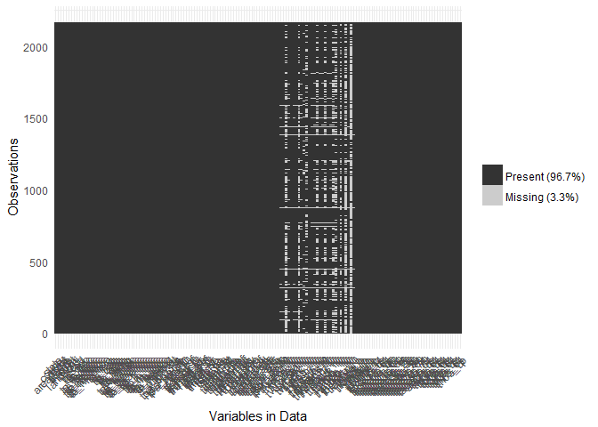
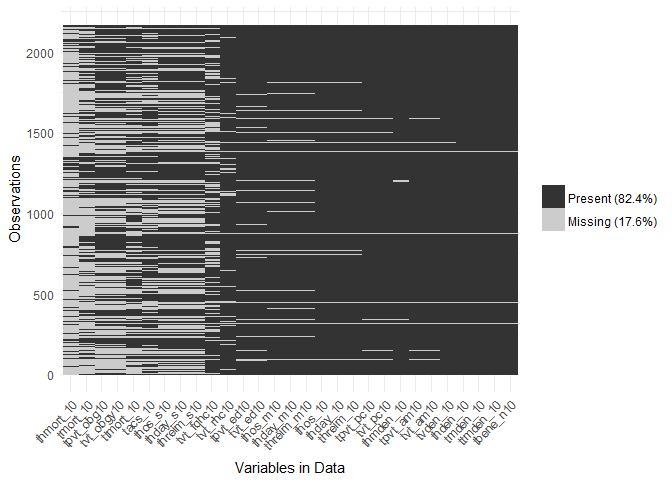

Dartmouth Explore Missings
================
2016-12-02

``` r
# Install packages if needed
package_list <- c("tidyverse", "stringr", "foreign", "viridis", "rmarkdown", "knitr", "devtools")
new_packages <- package_list[! package_list %in% installed.packages()[,"Package"]]
if(length(new_packages)) install.packages(new_packages)

# devtools::install_github("njtierney/ggmissing")
# devtools::install_github("njtierney/visdat")

library(tidyverse) # for tidy data manipulation
library(stringr) # for string manipulation
library(foreign) # For reading in different file formats (incl DBF)
library(ggmissing) # for summarizing/plotting missing data
library(visdat) # for more plots of missing data 
```

``` r
dart_raw <- read.dbf("../dropbox/capstone/data/raw/t_103113_1.dbf", as.is = TRUE)
names(dart_raw) <- names(dart_raw) %>% str_to_lower()
```

``` r
dart_nyc <- 
  dart_raw %>% 
  as_data_frame() %>% 
  filter(county %in% c("36005", "36047", "36061", "36081", "36085")) %>% 
  mutate_if(is.double, funs(if_else(. %in% c(-99, -999), NA_real_, .)))
```

``` r
dart_nyc %>% percent_missing_df() # overall percentage of missing data
```

    ## [1] 3.263081

``` r
dart_nyc %>% percent_missing_case() # % of cases that contain missing data
```

    ## [1] 92.98893

``` r
dart_nyc %>% percent_missing_var() # % of variables that contain missing data
```

    ## [1] 18.58974

``` r
dart_nyc %>% table_missing_case() # tabulations of missing data across cases
```

    ## # A tibble: 27 × 3
    ##    n_missing_in_case n_missing   percent
    ##                <int>     <int>     <dbl>
    ## 1                  0       152  7.011070
    ## 2                  1       350 16.143911
    ## 3                  2       326 15.036900
    ## 4                  3       208  9.594096
    ## 5                  4       162  7.472325
    ## 6                  5       114  5.258303
    ## 7                  6       112  5.166052
    ## 8                  7       101  4.658672
    ## 9                  8       153  7.057196
    ## 10                 9       222 10.239852
    ## # ... with 17 more rows

``` r
dart_nyc %>% summary_missing_var() # summary information of missing data for variables and cases
```

    ## # A tibble: 156 × 3
    ##      variable n_missing  percent
    ##         <chr>     <int>    <dbl>
    ## 1   thmort_10      1766 81.45756
    ## 2    tmort_10      1313 60.56273
    ## 3  tpvt_obg10       934 43.08118
    ## 4  tvt_obgy10       934 43.08118
    ## 5   ttmort_10       909 41.92804
    ## 6     tacs_10       835 38.51476
    ## 7    thos_s10       756 34.87085
    ## 8   thday_s10       756 34.87085
    ## 9  threim_s10       756 34.87085
    ## 10 tvt_fqhc10       720 33.21033
    ## # ... with 146 more rows

``` r
dart_nyc %>% vis_miss()
```



``` r
miss_vars <- 
  dart_nyc %>% 
  summary_missing_var() %>% 
  filter(n_missing != 0) %>% 
  .[["variable"]]

dart_nyc %>% 
  select(one_of(miss_vars)) %>% 
  vis_miss()
```


