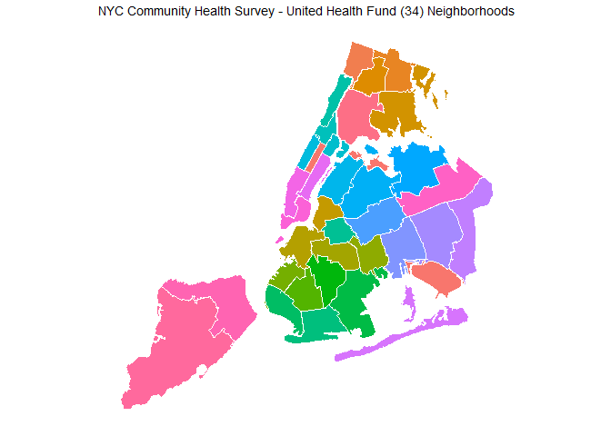

NYC CHS - UHF Map
================

``` r
# Install packages if needed
package_list <- c("tidyverse", "ggthemes", "rgdal", "maptools")
new_packages <- package_list[! package_list %in% installed.packages()[,"Package"]]
if(length(new_packages)) install.packages(new_packages)

# Load packages
library(tidyverse) # for tidy data manipulation
library(ggthemes) # for additional ggplot2 themes (eg. theme_map)
library(rgdal) # for reading in shapefiles
library(maptools) # for manipulating spatial data

# Set directories
root <- "C:/Users/austensen/Dropbox/capstone/"
knitr::opts_knit$set(root.dir = root)
# setwd(root)
```

### Load shapefile and prep for mapping

### Map United Hospital Fund Neighborhoods

``` r
ggplot(chs.df) + 
  aes(long,lat,group=group,fill=factor(UHF_CODE)) + 
  geom_polygon() +
  geom_path(color="white") +
  coord_equal() +
  scale_fill_discrete(guide = FALSE) +
  ggtitle("NYC Community Health Survey - United Health Fund (34) Neighborhoods") +
  theme_map()
```


