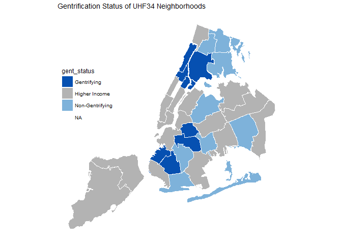
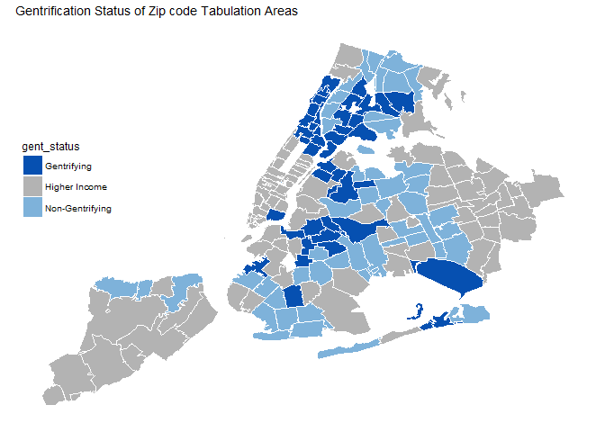
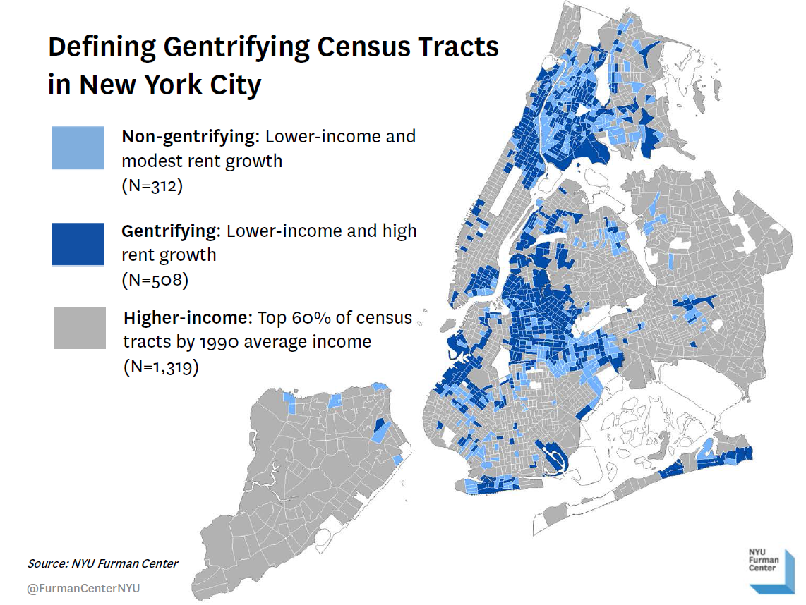

Gentrification Maps (ZCTA & UHF34)
================

``` r
# Install packages if needed
package_list <- c("tidyverse", "ggthemes", "rgdal", "maptools", "feather")
new_packages <- package_list[! package_list %in% installed.packages()[,"Package"]]
if(length(new_packages)) install.packages(new_packages)

# Load packages
library(tidyverse) # for tidy data manipulation
library(ggthemes) # for additional ggplot2 themes (eg. theme_map)
library(rgdal) # for reading in shapefiles
library(maptools) # for manipulating spatial data
library(feather) # for saving data fileslibrary(tidyverse)
```

### Load gentrification data and shapefiles

``` r
# Zipcodes (ZCTAs)
gent_zip <- read_feather("../Dropbox/capstone/data/clean/gentrification/gent_zip.feather")

zip <- tigris::zctas(starts_with = c("10", "11"), year = 2012)


# HF#$ neighborhoods
gent_uhf34 <- read_feather("../Dropbox/capstone/data/clean/gentrification/gent_uhf34.feather")

uhf <- readOGR(dsn = "../dropbox/capstone/gis/CHS_2009_DOHMH_2010B", layer = "CHS_2009_DOHMH_2010B", verbose = FALSE)
```

### Map Gentrification Classification of UHF34 Neighborhoods

``` r
uhf@data$id <- rownames(uhf@data)
uhf_points <- fortify(uhf, region = "id")
uhf_df <- 
  uhf_points %>% 
  left_join(uhf@data, by = "id") %>% 
  mutate(uhf34_code = as.character(UHF34_CODE)) %>% 
  left_join(gent_uhf34, by = "uhf34_code")

ggplot() +
  geom_map(data = uhf_df, map = uhf_df,
  aes(x = long, y = lat, map_id = id, fill = gent_status), color = 'white', size = 0.25) +
  scale_fill_manual(values = c("#0650B1", "#B3B3B3", "#7EB2DA")) +
  coord_equal() +
  theme_map() + 
  theme(legend.position = c(0, .5)) +
  ggtitle("Gentrification Status of UHF34 Neighborhoods")
```



### Map Gentrification Classification of Zip code Tabulation Areas

``` r
zip_points <- fortify(zip, region = "GEOID10")
zip_df <- 
  zip_points %>% 
  left_join(zip@data, by = c("id" = "GEOID10")) %>% 
  mutate(zcta = as.numeric(id)) %>% 
  right_join(gent_zip, by = "zcta")

ggplot() +
  geom_map(data = zip_df, map = zip_df,
  aes(x = long, y = lat, map_id = id, fill = gent_status), color = 'white', size = 0.25) +
  scale_fill_manual(values = c("#0650B1", "#B3B3B3", "#7EB2DA")) +
  coord_equal() +
  theme_map() +
  theme(legend.position = c(0, .5)) +
  ggtitle("Gentrification Status of Zip code Tabulation Areas")
```




